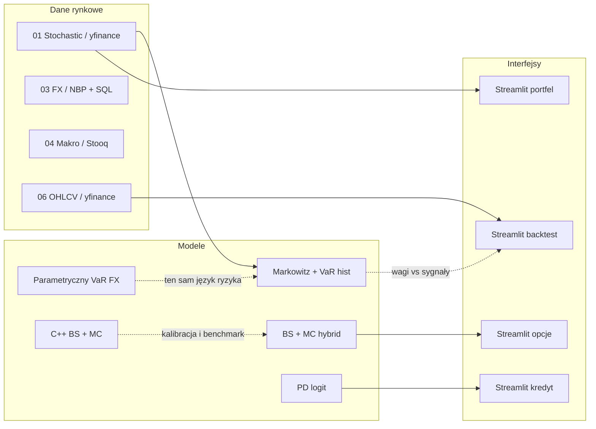

# Q-Fin Portfolio

Repozytorium to jest **segmentową biblioteką projektów ilościowych**: od modeli stochastycznych i wyceny po ryzyko rynkowe, makro, interfejsy, backtest i jądro C++. Każdy katalog `0x_*` ma własny, krótki `README.md` z celem, teorią i powiązaniami. Poniżej jest **mapa całego sektora**: jak zestawić moduły w jednym łańcuchu analitycznym oraz **fragmenty kodu wprost z repozytorium**.

## Mapa modułów



## Jak połączyć projekty w praktyce

1. **Alokacja i ryzyko portfela akcji**  
   W `01_Stochastic_Models` optymalizujesz wagi (`EfficientFrontier`), a następnie możesz przenieść te wagi do raportu ryzyka: historyczny VaR jest już liczony w tej samej aplikacji na zwrotach portfela. Równolegle w `03_Risk_Management` liczysz **parametryczny VaR** dla ekspozycji FX — to uzupełnia obraz ryzyka, gdy portfel ma niewypłaszczone czynniki walutowe.

2. **Spójność wyceny opcji**  
   W `02_Pricing_Engines` masz pełny łańcuch BS + MC + hybryda. W `05_Interactive_Dashboards/Derivatives_Pricing_App` ten sam problem jest eksplorowany interaktywnie. W `08_Numerical_Kernels/cpp` dostajesz **referencyjną** implementację analityczną i MC w C++ — warto porównać średnią z MC w Pythonie i w C++ przy tych samych \(S, K, T, r, \sigma\) i liczbie ścieżek (różnice powinny maleć wraz z \(N\)).

3. **Kontekst makro dla stóp i zmienności**  
   Moduł `04_Quantitative_Analysis` nie podaje bezpośrednio \(r\) ani \(\sigma\) do innych folderów, ale stan krzywej (spread, inwersja) można traktować jako **kontekst** przy ustalaniu stopy bezryzyka w optymalizacji (`01`) lub scenariuszy w wycenie (`02`, `05`).

4. **Strategia techniczna vs optymalizacja mean–variance**  
   `06_Algorithmic_Trading` realizuje regułę EMA na jednym instrumencie; wagi z `01` realizują regułę mean–variance na koszyku. Porównanie „ex-ante” (front efektywny) z „ex-post” (krzywa equity z backtestu) wymaga osobnej metodologii (np. te same aktywa, ten sam horyzont) — repozytorium daje **obie** ścieżki w kodzie.

5. **Rynek vs kredyt**  
   `07_Credit_Risk_Modeling` dostarcza warstwę PD (logit / logistyczna regresja w `src/model_engine.py`). W instytucji łączy się to z **VaR rynkowym** (`03`) w raportach zagregowanego ryzyka (EAD, LGD, korelacje — poza zakresem tego repo, ale punkt zaczepienia jest w PD i VaR).

---

## Fragmenty kodu z repozytorium

### 1. Hybrid BS + Monte Carlo + hybryda (Python)

```36:49:02_Pricing_Engines/Hybrid_pricing_engine.py
        d1 = (np.log(self.spot_price / self.strike_price) + (self.risk_free_rate + 0.5 * self.volatility**2) * self.time_to_maturity) / (self.volatility * np.sqrt(self.time_to_maturity))
        d2 = d1 - self.volatility * np.sqrt(self.time_to_maturity)
        bs_price = self.spot_price * norm.cdf(d1) - self.strike_price * np.exp(-self.risk_free_rate * self.time_to_maturity) * norm.cdf(d2)

        np.random.seed(42)
        z = np.random.standard_normal(self.iterations)
        
        simulated_spot = self.spot_price * np.exp((self.risk_free_rate - 0.5 * self.volatility**2) * self.time_to_maturity + self.volatility * np.sqrt(self.time_to_maturity) * z)
        payoffs = np.maximum(simulated_spot - self.strike_price, 0)
        pv_payoffs = np.exp(-self.risk_free_rate * self.time_to_maturity) * payoffs
        
        hybrid_contributions = pv_payoffs + 1.0 * (bs_price - pv_payoffs)
```

### 2. Black–Scholes w dashboardzie pochodnych (Python)

```4:12:05_Interactive_Dashboards/Derivatives_Pricing_App/src/analytical.py
def black_scholes_european(S, K, T, r, sigma, option_type="call"):

    d1 = (np.log(S / K) + (r + 0.5 * sigma**2) * T) / (sigma * np.sqrt(T))
    d2 = d1 - sigma * np.sqrt(T)
    
    if option_type == "call":
        return S * norm.cdf(d1) - K * np.exp(-r * T) * norm.cdf(d2)
    else:
        return K * np.exp(-r * T) * norm.cdf(-d2) - S * norm.cdf(-d1)
```

### 3. Ten sam model analityczny w C++

```12:20:08_Numerical_Kernels/cpp/src/black_scholes.cpp
double black_scholes_call(double spot, double strike, double time_years, double rate, double vol) {
    if (time_years <= 0.0 || vol <= 0.0 || spot <= 0.0 || strike <= 0.0) {
        return std::max(spot - strike, 0.0);
    }
    const double sqrt_t = std::sqrt(time_years);
    const double d1 =
        (std::log(spot / strike) + (rate + 0.5 * vol * vol) * time_years) / (vol * sqrt_t);
    const double d2 = d1 - vol * sqrt_t;
    return spot * norm_cdf(d1) - strike * std::exp(-rate * time_years) * norm_cdf(d2);
}
```

### 4. Parametryczny VaR FX (Python)

```30:46:03_Risk_Management/var_calculator.py
        df['returns'] = np.log(df['rate_mid'] / df['rate_mid'].shift(1))
        df = df.dropna()
        
        volatility = df['returns'].std()
        
        z_score = norm.ppf(confidence_level) 
        
        var_pct = z_score * volatility
        var_value = exposure * var_pct
        
        print(f"Analyzed trading sessions : {len(df)}")
        print(f"Daily VaR ({confidence_level:.0%})      : {var_pct:.4%}")
        print(f"Potential Loss Exposure   : {var_value:,.2f} PLN (on {exposure:,.0f} PLN portfolio)\n")
```

### 5. Markowitz + historyczny VaR portfela w jednej aplikacji (Python)

```13:16:01_Stochastic_Models/portfolio_optimizer_app.py
def calculate_historical_var(data: pd.DataFrame, weights: pd.Series, alpha: float = 0.05) -> float:
    """Calculates historical Value at Risk for a given portfolio."""
    portfolio_returns = (data.pct_change().dropna() * pd.Series(weights)).sum(axis=1)
    return portfolio_returns.quantile(alpha)
```

```62:78:01_Stochastic_Models/portfolio_optimizer_app.py
            mu = expected_returns.mean_historical_return(data)
            S = risk_models.sample_cov(data)
            ef = EfficientFrontier(mu, S)
            
            if strategy == "Max Sharpe Ratio":
                ef.max_sharpe(risk_free_rate=rf_rate)
            elif strategy == "Minimum Volatility":
                ef.min_volatility()
            elif strategy == "Target Return (15%)":
                ef.efficient_return(target_return=0.15)
            
            clean_weights = ef.clean_weights()
            perf = ef.portfolio_performance(verbose=False, risk_free_rate=rf_rate)
            var_value = calculate_historical_var(data, clean_weights)
```

### 6. Backtest EMA: krzywa kapitału i metryki (Python)

```7:38:06_Algorithmic_Trading/src/engine.py
class BacktestEngine:
    def __init__(self, data: pd.DataFrame):
        self.data = data

    def equity_curve(self, close: pd.Series, signal: pd.Series, initial: float = 100_000.0) -> pd.Series:
        aligned = pd.DataFrame({"close": close, "signal": signal}).dropna()
        position = aligned["signal"].shift(1).fillna(0.0)
        ret = aligned["close"].pct_change().fillna(0.0)
        strat = position * ret
        growth = (1.0 + strat).cumprod()
        return initial * growth

    def metrics(self, equity: pd.Series, risk_free_annual: float = 0.02) -> dict[str, float]:
        er = equity.pct_change().dropna()
        if len(er) < 2 or float(er.std()) == 0.0:
            return {"total_return": 0.0, "cagr": 0.0, "sharpe": 0.0, "max_drawdown": 0.0}
        total_return = float(equity.iloc[-1] / equity.iloc[0] - 1.0)
        n = len(equity)
        years = n / 252.0 if n > 0 else 1.0
        cagr = float((equity.iloc[-1] / equity.iloc[0]) ** (1.0 / max(years, 1e-9)) - 1.0) if equity.iloc[0] > 0 else 0.0
        rf_daily = risk_free_annual / 252.0
        excess = er - rf_daily
        sharpe = float(np.sqrt(252.0) * excess.mean() / excess.std())
        cum = (1.0 + er).cumprod()
        peak = cum.cummax()
        mdd = float((cum / peak - 1.0).min())
        return {
            "total_return": total_return,
            "cagr": cagr,
            "sharpe": sharpe,
            "max_drawdown": mdd,
        }
```

### 7. Silnik PD (logistyczna regresja, Python)

```5:14:07_Credit_Risk_Modeling/src/model_engine.py
class ProbabilityOfDefaultModel:
    def __init__(self, c_parameter: float = 0.1):
        self.model = LogisticRegression(C=c_parameter, penalty="l2", solver="lbfgs")

    def fit(self, X, y):
        self.model.fit(X, y)
        joblib.dump(self, "pd_model_v1.pkl")

    def predict_pd(self, X_input):
        return self.model.predict_proba(X_input)[:, 1]
```

---

## Benchmarki Python ↔ C++ (`benchmarks/`)

Rozszerzenie **`qfin_cpp`** (katalog `08_Numerical_Kernels/qfin_cpp_ext`) udostępnia w Pythonie te same funkcje co kod w `cpp/`, dzięki **pybind11**. Skrypt `benchmarks/bs_mc_benchmark.py` (CLI: **Typer**, tabele: **Rich**) mierzy czasy BS i Monte Carlo oraz różnice wartości względem implementacji NumPy/SciPy.

```bash
pip install pybind11
pip install -e 08_Numerical_Kernels/qfin_cpp_ext
pip install -r requirements-benchmarks.txt
python benchmarks/bs_mc_benchmark.py --paths 500000
```

Szczegóły: [benchmarks/README.md](benchmarks/README.md).

## Biblioteki „profesjonalne” w projekcie

| Biblioteka | Gdzie | Po co |
|------------|--------|--------|
| **httpx** | `03_Risk_Management/fx_data_loader.py`, `04_Quantitative_Analysis/yield_curve_inversion.py` | HTTP z timeoutami, spójne API; łatwe rozszerzenie o HTTP/2 / async. |
| **tenacity** | te same moduły | Powtarzanie zapytań przy chwilowych błędach sieci (NBP, Stooq). |
| **rich** | `02_Pricing_Engines/report_formatter.py` | Czytelne tabele w terminalu (fallback na zwykły tekst bez Rich). |
| **cachetools** | `06_Algorithmic_Trading/src/data_loader.py` | Cache TTL dla pobierania OHLCV (`yfinance`), mniej zapytań przy strojeniu backtestu. |
| **pydantic-settings** | `03_Risk_Management/config.example.py` | Wzorzec `DB_CONFIG` z walidacją i prefixem `QFIN_DB_` (skopiuj do `config.py` lub użyj `.env`). |
| **pybind11** | `08_Numerical_Kernels/qfin_cpp_ext` | Wspólne benchmarki i ewentualna produkcyjna ścieżka „gorąca” w C++. |

## Indeks katalogów

| Katalog | Temat |
|---------|--------|
| `01_Stochastic_Models` | MPT, front efektywny, VaR historyczny portfela (Streamlit) |
| `02_Pricing_Engines` | BS, MC, hybryda, raportowanie symulacji |
| `03_Risk_Management` | FX z NBP/SQL, VaR parametryczny |
| `04_Quantitative_Analysis` | Spread krzywej, inwersja (Stooq / demo) |
| `05_Interactive_Dashboards` | UI: wycena opcji, devcontainer |
| `06_Algorithmic_Trading` | EMA crossover, backtest, Streamlit |
| `07_Credit_Risk_Modeling` | PD, dashboard, `sklearn` w `src/model_engine.py` |
| `08_Numerical_Kernels` | C++: BS + MC, CMake, opcjonalnie moduł `qfin_cpp` (pybind11) |
| `benchmarks/` | Porównanie czasu i wartości BS/MC: Python vs `qfin_cpp` |

## Zależności

W katalogu głównym jest plik `requirements.txt` (w tym httpx, tenacity, rich, cachetools, pydantic). Do benchmarków i budowy rozszerzenia użyj `requirements-benchmarks.txt` oraz `pip install pybind11`. Moduł `03` może korzystać z `config.py` (jak dotąd) albo wzorca `config.example.py` z **pydantic-settings** i zmiennych `QFIN_DB_*`. Natywny program demonstracyjny C++ wymaga **CMake** i kompilatora **C++17**; moduł Python `qfin_cpp` wymaga tego samego toolchainu przy `pip install -e qfin_cpp_ext`.

## Inspiracja stylem dokumentacji

Układ „cel → teoria → pliki → uruchomienie → powiązania” jest zbliżony do dobrych praktyk repozytoriów typu **quant / risk** (np. projekty z ekosystemu GitHub wyszukiwane jako [quantrisk](https://github.com/search?q=quantrisk&type=repositories)), z naciskiem na **powiązania między modułami** i cytaty z własnego kodu.
