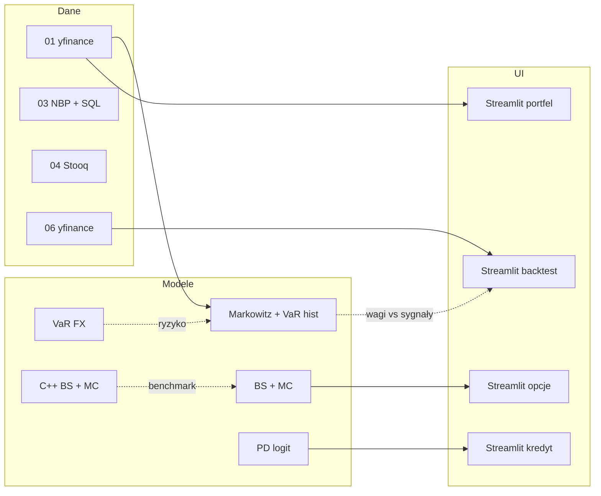

# Q-Fin Portfolio

[](https://www.python.org/downloads/)

Biblioteka **projektów ilościowych** w Pythonie i C++: alokacja portfela, wycena opcji, VaR (historyczny i parametryczny), makro / krzywa, dashboardy Streamlit, backtest strategii, PD kredytowe oraz jądro numeryczne z opcjonalnym **pybind11**.

| # | Katalog | Temat |
|---|---------|--------|
| 01 | [`01_Portfolio_Optimization`](01_Portfolio_Optimization) | Markowitz, front efektywny, historyczny VaR (Streamlit) |
| 02 | [`02_Options_Pricing`](02_Options_Pricing) | BS + Monte Carlo + hybryda |
| 03 | [`03_FX_And_Market_Risk`](03_FX_And_Market_Risk) | NBP → SQL, VaR parametryczny FX |
| 04 | [`04_Macro_Yield_Curve`](04_Macro_Yield_Curve) | Spread krzywej, inwersja |
| 05 | [`05_Derivatives_Dashboard`](05_Derivatives_Dashboard) | Streamlit: opcje, devcontainer |
| 06 | [`06_Strategy_Backtest`](06_Strategy_Backtest) | EMA crossover, metryki backtestu |
| 07 | [`07_Credit_Risk`](07_Credit_Risk) | PD, logistyczna regresja |
| 08 | [`08_CPP_Pricing_Core`](08_CPP_Pricing_Core) | C++ BS/MC, CMake, `qfin_cpp` |
| — | [`benchmarks/`](benchmarks) | Porównanie czasu i wartości Python ↔ C++ |

Każdy moduł ma własny `README.md` (cel, teoria z poprawnymi wzorami, uruchomienie, powiązania).

---

## Mapa przepływu danych



## Jak łączyć moduły

1. **Portfel + ryzyko** — W [`01_Portfolio_Optimization`](01_Portfolio_Optimization) optymalizujesz wagi i widzisz historyczny VaR na zwrotach portfela. Równolegle [`03_FX_And_Market_Risk`](03_FX_And_Market_Risk) daje **parametryczny VaR** dla ekspozycji walutowej.

2. **Wycena opcji** — [`02_Options_Pricing`](02_Options_Pricing): BS + MC + hybryda. [`05_Derivatives_Dashboard`](05_Derivatives_Dashboard) eksploruje to interaktywnie. W [`08_CPP_Pricing_Core/cpp`](08_CPP_Pricing_Core/cpp) jest referencyjna implementacja w C++; sensownie porównywać średnie MC w Pythonie i w C++ przy tych samych $S$, $K$, $T$, $r$, $\sigma$ i liczbie ścieżek $N$.

3. **Makro** — [`04_Macro_Yield_Curve`](04_Macro_Yield_Curve) nie podaje automatycznie $r$ ani $\sigma$ do innych folderów, ale spread / inwersja stanowią **kontekst** dla stóp w `01` i scenariuszy w `02` / `05`.

4. **Strategia vs optymalizacja** — [`06_Strategy_Backtest`](06_Strategy_Backtest): reguła EMA na jednym instrumencie; `01`: mean–variance na koszyku. To dwie różne filozofie alokacji — repo udostępnia obie ścieżki w kodzie.

5. **Rynek vs kredyt** — [`07_Credit_Risk`](07_Credit_Risk): PD (logit / `sklearn`). W praktyce instytucjonalnej łączy się to z VaR rynkowym z `03` w szerszym frameworku (EAD, LGD — poza tym repozytorium).

---

## Fragmenty kodu

### 1. Hybrid BS + MC (Python)

```36:49:02_Options_Pricing/Hybrid_pricing_engine.py
        d1 = (np.log(self.spot_price / self.strike_price) + (self.risk_free_rate + 0.5 * self.volatility**2) * self.time_to_maturity) / (self.volatility * np.sqrt(self.time_to_maturity))
        d2 = d1 - self.volatility * np.sqrt(self.time_to_maturity)
        bs_price = self.spot_price * norm.cdf(d1) - self.strike_price * np.exp(-self.risk_free_rate * self.time_to_maturity) * norm.cdf(d2)

        np.random.seed(42)
        z = np.random.standard_normal(self.iterations)
        
        simulated_spot = self.spot_price * np.exp((self.risk_free_rate - 0.5 * self.volatility**2) * self.time_to_maturity + self.volatility * np.sqrt(self.time_to_maturity) * z)
        payoffs = np.maximum(simulated_spot - self.strike_price, 0)
        pv_payoffs = np.exp(-self.risk_free_rate * self.time_to_maturity) * payoffs
        
        hybrid_contributions = pv_payoffs + 1.0 * (bs_price - pv_payoffs)
```

### 2. Black–Scholes w dashboardzie

```4:12:05_Derivatives_Dashboard/Derivatives_Pricing_App/src/analytical.py
def black_scholes_european(S, K, T, r, sigma, option_type="call"):

    d1 = (np.log(S / K) + (r + 0.5 * sigma**2) * T) / (sigma * np.sqrt(T))
    d2 = d1 - sigma * np.sqrt(T)
    
    if option_type == "call":
        return S * norm.cdf(d1) - K * np.exp(-r * T) * norm.cdf(d2)
    else:
        return K * np.exp(-r * T) * norm.cdf(-d2) - S * norm.cdf(-d1)
```

### 3. BS w C++

```12:20:08_CPP_Pricing_Core/cpp/src/black_scholes.cpp
double black_scholes_call(double spot, double strike, double time_years, double rate, double vol) {
    if (time_years <= 0.0 || vol <= 0.0 || spot <= 0.0 || strike <= 0.0) {
        return std::max(spot - strike, 0.0);
    }
    const double sqrt_t = std::sqrt(time_years);
    const double d1 =
        (std::log(spot / strike) + (rate + 0.5 * vol * vol) * time_years) / (vol * sqrt_t);
    const double d2 = d1 - vol * sqrt_t;
    return spot * norm_cdf(d1) - strike * std::exp(-rate * time_years) * norm_cdf(d2);
}
```

### 4. VaR parametryczny FX

```30:46:03_FX_And_Market_Risk/var_calculator.py
        df['returns'] = np.log(df['rate_mid'] / df['rate_mid'].shift(1))
        df = df.dropna()
        
        volatility = df['returns'].std()
        
        z_score = norm.ppf(confidence_level) 
        
        var_pct = z_score * volatility
        var_value = exposure * var_pct
        
        print(f"Analyzed trading sessions : {len(df)}")
        print(f"Daily VaR ({confidence_level:.0%})      : {var_pct:.4%}")
        print(f"Potential Loss Exposure   : {var_value:,.2f} PLN (on {exposure:,.0f} PLN portfolio)\n")
```

### 5. Markowitz + VaR historyczny

```13:16:01_Portfolio_Optimization/portfolio_optimizer_app.py
def calculate_historical_var(data: pd.DataFrame, weights: pd.Series, alpha: float = 0.05) -> float:
    """Calculates historical Value at Risk for a given portfolio."""
    portfolio_returns = (data.pct_change().dropna() * pd.Series(weights)).sum(axis=1)
    return portfolio_returns.quantile(alpha)
```

```62:78:01_Portfolio_Optimization/portfolio_optimizer_app.py
            mu = expected_returns.mean_historical_return(data)
            S = risk_models.sample_cov(data)
            ef = EfficientFrontier(mu, S)
            
            if strategy == "Max Sharpe Ratio":
                ef.max_sharpe(risk_free_rate=rf_rate)
            elif strategy == "Minimum Volatility":
                ef.min_volatility()
            elif strategy == "Target Return (15%)":
                ef.efficient_return(target_return=0.15)
            
            clean_weights = ef.clean_weights()
            perf = ef.portfolio_performance(verbose=False, risk_free_rate=rf_rate)
            var_value = calculate_historical_var(data, clean_weights)
```

### 6. Backtest engine

```7:38:06_Strategy_Backtest/src/engine.py
class BacktestEngine:
    def __init__(self, data: pd.DataFrame):
        self.data = data

    def equity_curve(self, close: pd.Series, signal: pd.Series, initial: float = 100_000.0) -> pd.Series:
        aligned = pd.DataFrame({"close": close, "signal": signal}).dropna()
        position = aligned["signal"].shift(1).fillna(0.0)
        ret = aligned["close"].pct_change().fillna(0.0)
        strat = position * ret
        growth = (1.0 + strat).cumprod()
        return initial * growth

    def metrics(self, equity: pd.Series, risk_free_annual: float = 0.02) -> dict[str, float]:
        er = equity.pct_change().dropna()
        if len(er) < 2 or float(er.std()) == 0.0:
            return {"total_return": 0.0, "cagr": 0.0, "sharpe": 0.0, "max_drawdown": 0.0}
        total_return = float(equity.iloc[-1] / equity.iloc[0] - 1.0)
        n = len(equity)
        years = n / 252.0 if n > 0 else 1.0
        cagr = float((equity.iloc[-1] / equity.iloc[0]) ** (1.0 / max(years, 1e-9)) - 1.0) if equity.iloc[0] > 0 else 0.0
        rf_daily = risk_free_annual / 252.0
        excess = er - rf_daily
        sharpe = float(np.sqrt(252.0) * excess.mean() / excess.std())
        cum = (1.0 + er).cumprod()
        peak = cum.cummax()
        mdd = float((cum / peak - 1.0).min())
        return {
            "total_return": total_return,
            "cagr": cagr,
            "sharpe": sharpe,
            "max_drawdown": mdd,
        }
```

### 7. Model PD

```5:14:07_Credit_Risk/src/model_engine.py
class ProbabilityOfDefaultModel:
    def __init__(self, c_parameter: float = 0.1):
        self.model = LogisticRegression(C=c_parameter, penalty="l2", solver="lbfgs")

    def fit(self, X, y):
        self.model.fit(X, y)
        joblib.dump(self, "pd_model_v1.pkl")

    def predict_pd(self, X_input):
        return self.model.predict_proba(X_input)[:, 1]
```

---

## Benchmarki (`benchmarks/`)

Moduł **`qfin_cpp`** w [`08_CPP_Pricing_Core/qfin_cpp_ext`](08_CPP_Pricing_Core/qfin_cpp_ext) udostępnia w Pythonie funkcje z `cpp/`. Skrypt [`benchmarks/bs_mc_benchmark.py`](benchmarks/bs_mc_benchmark.py) (**Typer**, **Rich**) mierzy czasy BS i MC.

```bash
pip install pybind11
pip install -e 08_CPP_Pricing_Core/qfin_cpp_ext
pip install -r requirements-benchmarks.txt
python benchmarks/bs_mc_benchmark.py --paths 500000
```

## Biblioteki (wybrane)

| Biblioteka | Gdzie |
|------------|--------|
| **httpx** | `03_FX_And_Market_Risk/fx_data_loader.py`, `04_Macro_Yield_Curve/yield_curve_inversion.py` |
| **tenacity** | ponawianie zapytań HTTP |
| **rich** | `02_Options_Pricing/report_formatter.py` |
| **cachetools** | `06_Strategy_Backtest/src/data_loader.py` |
| **pydantic-settings** | `03_FX_And_Market_Risk/config.example.py` |
| **pybind11** | `08_CPP_Pricing_Core/qfin_cpp_ext` |

## Zależności i narzędzia

- [`requirements.txt`](requirements.txt) — środowisko Python modułów głównych.
- [`requirements-benchmarks.txt`](requirements-benchmarks.txt) — benchmarki + pybind11.
- C++: **CMake** 3.16+, kompilator **C++17** (`bs_demo` oraz budowa `qfin_cpp`).

## Notacja matematyczna na GitHubie

W README używane są **dolary** w stylu GitHub: `$...$` (inline) oraz `$$...$$` (blok). Składnia `\(...\)` nie jest renderowana.

## Inspiracja

Układ dokumentacji zbliżony jest do repozytoriów **quant / risk** (np. wyszukiwanie [quantrisk na GitHubie](https://github.com/search?q=quantrisk&type=repositories)).
